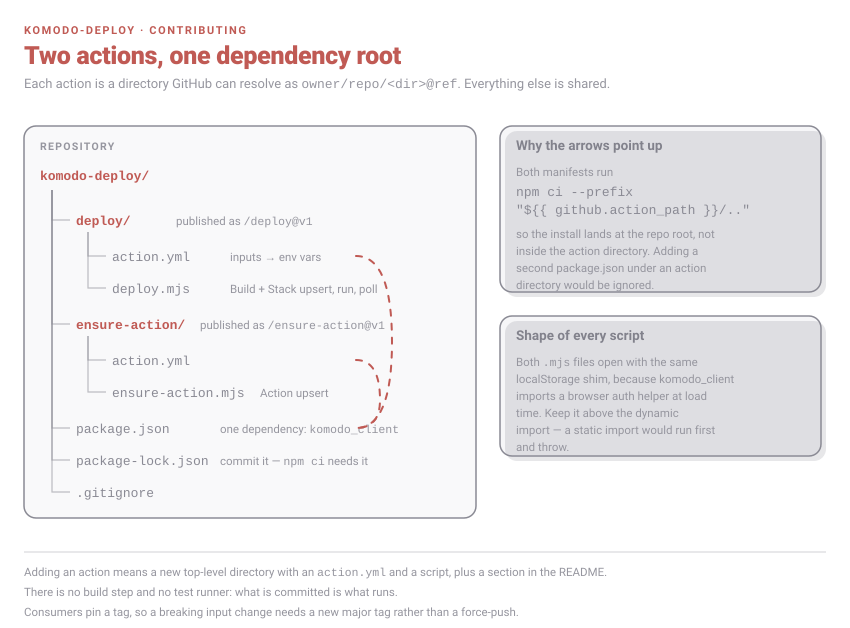

# Contributing

Small on purpose: two composite actions, one dependency, no build step.

## Layout



Each action is a top-level directory — that is what lets a caller write
`BrockCSC/komodo-deploy/<dir>@<ref>`. Everything else is shared.

## How the actions are wired

Both `action.yml` files do the same two things:

1. `npm ci --prefix "${{ github.action_path }}/.."` — note the `/..`. Dependencies install at the
   **repository root**; a `package.json` under `deploy/` or `ensure-action/` is ignored.
2. `node "${{ github.action_path }}/<script>.mjs"`, with every input passed through as an env var.

An input therefore lives in three places: the `inputs:` block, the `env:` block mapping it to a
variable, and the script reading `process.env`. Adding one means touching all three.

## Shape of the scripts

Both `.mjs` files open with the same shim:

```js
globalThis.localStorage ??= new Map();
globalThis.localStorage.getItem ??= (k) => globalThis.localStorage.get(k) ?? null;
globalThis.localStorage.setItem ??= (k, v) => globalThis.localStorage.set(k, String(v));

const { KomodoClient } = await import("komodo_client");
```

`komodo_client` pulls in a browser auth helper that touches `globalThis.localStorage` on import,
which Node lacks. Keep the shim above the **dynamic** import — a static `import` is hoisted, runs
first, and throws.

## The upsert pattern

Every resource follows this shape, and new ones should too:

```js
let exists = true;
try {
  await komodo.read("GetThing", { thing: name });
} catch {
  exists = false;
}

if (exists) {
  await komodo.write("UpdateThing", { id: name, config });
} else {
  await komodo.write("CreateThing", { name, config });
}
```

That is what makes the actions self-healing: a fresh Komodo and a long-running one take the same
path, and drift made in the UI is corrected on the next deploy.

Anything that executes goes through `execute_and_poll`, and a failed update must print its logs
before throwing — "check the Komodo UI" is not a useful failure:

```js
if (!update.success) {
  for (const log of update.logs ?? []) {
    console.log(`::group::${log.stage}: ${log.command}`);
    if (log.stdout) console.log(log.stdout);
    if (log.stderr) console.error(log.stderr);
    console.log("::endgroup::");
  }
  throw new Error("… - see logs above.");
}
```

## Testing a change

Nothing is compiled and there is no test runner, so the only real test is a workflow run:

1. Push your branch.
2. In a consuming repo: `uses: BrockCSC/komodo-deploy/deploy@your-branch`.
3. Watch the run, then check the resource in Komodo.

Use a throwaway `build-name` and `stack-name` — the actions upsert, so pointing them at a live
resource **will** rewrite its config.

## Adding an action

A new top-level directory with an `action.yml` and a script, plus a README section. Don't add a
second `package.json`: put the dependency in the root one and commit the updated
`package-lock.json`, which `npm ci` requires.

## Releasing

Consumers pin a major tag such as `@v1`:

- A backwards-compatible change can move the existing major tag.
- Renaming or removing an input, or changing a default, needs a new major tag. Never force-push a
  breaking change onto a tag people are using.

## Docs

The diagrams in `docs/img/` are hand-written SVG, committed and referenced with ``, because
GitHub strips inline `<svg>`. A strict CSP blocks scripts, external images and web fonts, so keep
them self-contained and stick to system font stacks.

They use one flat palette legible on both GitHub themes rather than a pair per theme: an SVG's
`prefers-color-scheme` follows the operating system, not GitHub's setting, and the two disagree
often enough to make a theme-switched diagram unreadable.

Animation is CSS `@keyframes`, never SMIL, so it can be turned off — every animated file carries
`prefers-reduced-motion: reduce` and reads correctly when still.

If you change what an action does, update its diagram in the same pull request. A wrong picture is
worse than none.
