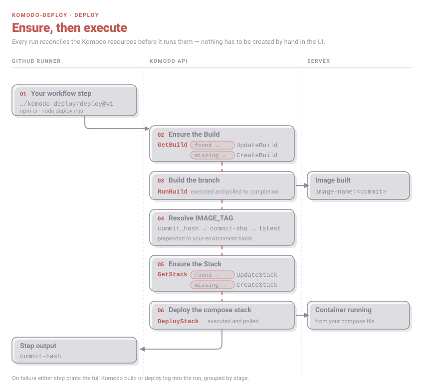
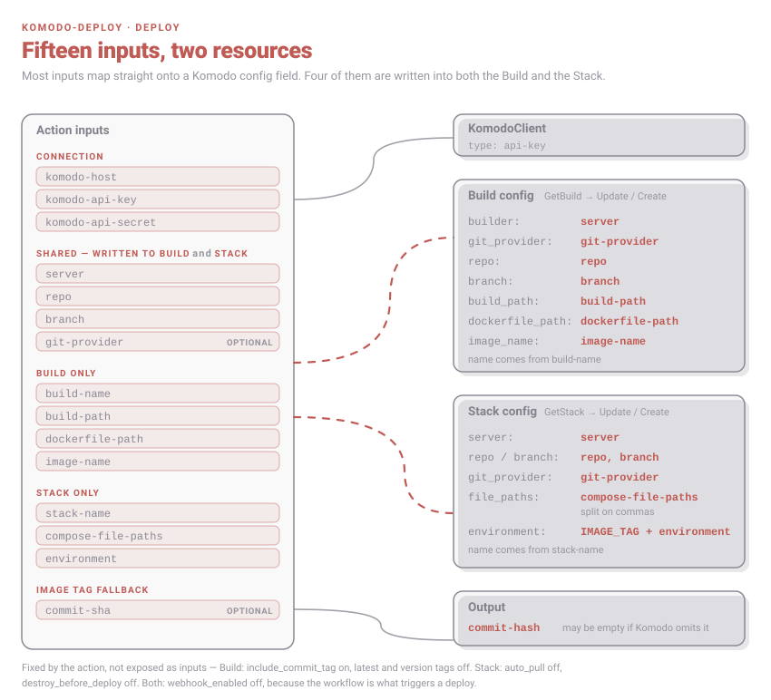
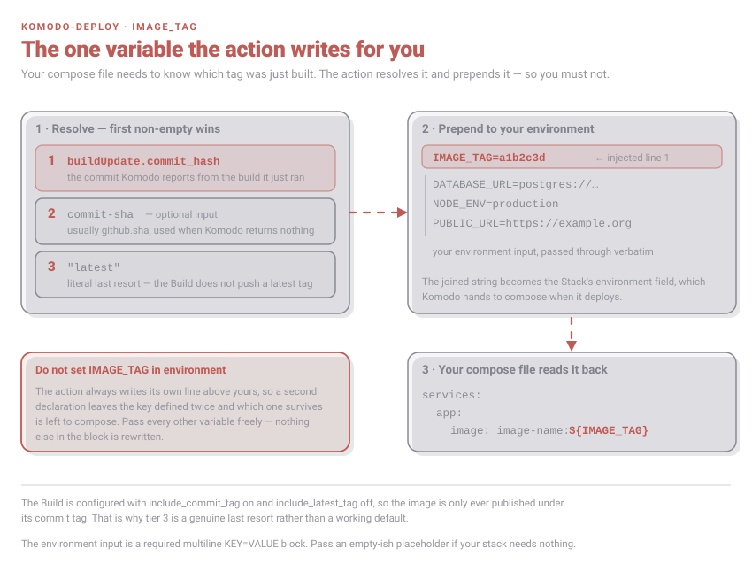
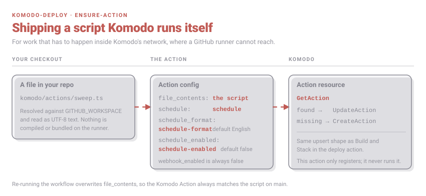

# komodo-deploy

Reusable GitHub Actions for deploying apps to a self-hosted [Komodo](https://komo.do) instance. Both actions use the
official [`komodo_client`](https://www.npmjs.com/package/komodo_client) npm package and are self-healing: they create
the Komodo resources they need on first run, so nothing has to be pre-configured by hand in the Komodo UI.



## `deploy`

Ensures a Komodo `Build` and `Stack` exist, builds the given branch, and deploys the resulting image. The Stack's
`environment` is automatically prefixed with `IMAGE_TAG=<build commit hash>` (falling back to `commit-sha`, then
`latest`) — don't include `IMAGE_TAG` yourself in the `environment` input.

```yaml
- id: deploy-context
  run: node komodo/deploy-context.mjs
  env:
    REF: ${{ github.ref }}
    SHA: ${{ github.sha }}

- uses: BrockCSC/komodo-deploy/deploy@v1
  with:
    komodo-host: ${{ vars.KOMODO_HOST }}
    komodo-api-key: ${{ secrets.KOMODO_API_KEY }}
    komodo-api-secret: ${{ secrets.KOMODO_API_SECRET }}
    build-name: brockcsc
    server: ${{ vars.KOMODO_SERVER }}
    repo: BrockCSC/website
    build-path: .
    dockerfile-path: Dockerfile
    image-name: brockcsc-ca
    branch: ${{ steps.deploy-context.outputs.branch }}
    stack-name: ${{ steps.deploy-context.outputs.stack-name }}
    compose-file-paths: deploy/docker-compose.yml
    environment: ${{ steps.deploy-context.outputs.environment }}
    commit-sha: ${{ github.sha }}
```

### Where each input lands

Most inputs map straight onto a field of the Komodo `Build` or `Stack` config. Four of them — `server`, `repo`,
`branch` and `git-provider` — are written to both.



### Inputs

| name                  | required | description                                                        |
| --------------------- | -------- | -------------------------------------------------------------------- |
| `komodo-host`         | yes      | Komodo API base URL                                                  |
| `komodo-api-key`      | yes      |                                                                        |
| `komodo-api-secret`   | yes      |                                                                        |
| `build-name`          | yes      | Komodo Build resource name (created if missing)                      |
| `server`              | yes      | Komodo Server name, used as both the Build's builder and Stack server |
| `repo`                | yes      | `owner/name`                                                          |
| `build-path`          | yes      |                                                                        |
| `dockerfile-path`     | yes      |                                                                        |
| `image-name`          | yes      |                                                                        |
| `branch`              | yes      | Branch (or tag name) to build and deploy from                        |
| `stack-name`          | yes      | Komodo Stack resource name (created if missing)                      |
| `compose-file-paths`  | yes      | Comma-separated, e.g. `deploy/docker-compose.yml`                    |
| `environment`         | yes      | Multiline `KEY=VALUE` block for the Stack's environment (excluding `IMAGE_TAG`) |
| `git-provider`        | no       | Default `github.com`                                                 |
| `commit-sha`          | no       | Fallback image tag if the Build's commit hash isn't available        |

Some config is fixed by the action and not exposed: the Build sets `include_commit_tag`, and clears the latest and
version tags; the Stack disables `auto_pull` and `destroy_before_deploy`. Both disable Komodo webhooks, because the
workflow is what triggers a deploy.

### Outputs

| name          | description                             |
| ------------- | ---------------------------------------- |
| `commit-hash` | Commit hash tagged on the built image    |

### `IMAGE_TAG`

The image is only ever published under its commit tag, so your compose file needs to be told which tag was just
built. The action resolves that itself and prepends it to the environment block you passed in.



Read it back the usual way:

```yaml
services:
  app:
    image: brockcsc-ca:${IMAGE_TAG}
```

Pass every other variable through `environment` freely — nothing else in the block is rewritten.

## `ensure-action`

Registers or updates a Komodo `Action` resource from a local script file, for logic that needs to run inside Komodo
(e.g. network access to a private docker network CI runners can't reach). This action only registers the script; it
never runs it.



```yaml
- uses: BrockCSC/komodo-deploy/ensure-action@v1
  with:
    komodo-host: ${{ vars.KOMODO_HOST }}
    komodo-api-key: ${{ secrets.KOMODO_API_KEY }}
    komodo-api-secret: ${{ secrets.KOMODO_API_SECRET }}
    action-name: brockcsc-preview-sweep
    script-path: komodo/actions/preview-sweep.ts
    schedule: "at 09:00 am"
    schedule-enabled: true
```

### Inputs

| name                | required | description                                                    |
| ------------------- | -------- | ---------------------------------------------------------------- |
| `komodo-host`       | yes      |                                                                    |
| `komodo-api-key`    | yes      |                                                                    |
| `komodo-api-secret` | yes      |                                                                    |
| `action-name`       | yes      | Komodo Action resource name (created if missing)                 |
| `script-path`       | yes      | Path, in the caller's checkout, to the `.ts` file to upload       |
| `schedule`          | no       | Komodo schedule string, e.g. `at 09:00 am`                       |
| `schedule-format`   | no       | Default `English`                                                 |
| `schedule-enabled`  | no       | Default `false`                                                   |

## When a run fails

Neither action points you at the Komodo UI. If a build or deploy fails, every Komodo log line is printed into the
workflow run, grouped by stage, before the step exits non-zero.

## Contributing

See [CONTRIBUTING.md](CONTRIBUTING.md).
