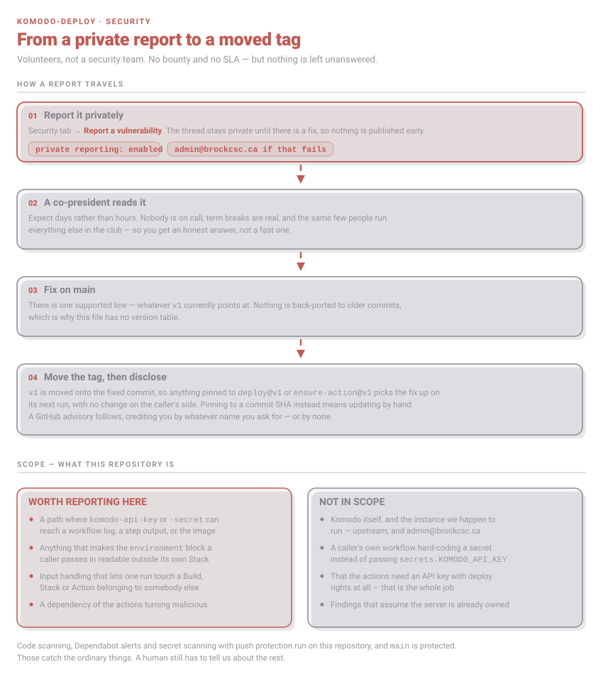

# Security policy

These actions are handed a Komodo API key and secret, and a caller's whole `environment` block, and
run them against a self-hosted Komodo. That is a small surface, but it is a credential-shaped one,
so it is worth a policy.

## Reporting

Use **[Report a vulnerability](https://github.com/BrockCSC/komodo-deploy/security/advisories/new)**
on the Security tab. Private reporting is enabled, so the thread stays between us until there is a
fix. If GitHub isn't an option, email **admin@brockcsc.ca** — it reaches the co-presidents and the
repo owner.

A workflow snippet that reproduces the problem is worth more than a description of it.

## What happens next

We're students, volunteering. There's no rota, no pager and no SLA. Someone will read your report
and answer you — days rather than hours, and slower over exams and the summer. There is **no bug
bounty**; we can offer credit in the advisory, under whatever name you like.

## Supported versions

Only `v1`, which is a moving tag: it is repointed at the fixed commit, so anything using
`BrockCSC/komodo-deploy/deploy@v1` picks a fix up on its next run. Nothing is back-ported to older
commits, and if you pin to a SHA you have to move it yourself.

## In scope

- **Credential leakage** — any path where `komodo-api-key` or `komodo-api-secret` reaches the
  workflow log, a step output, or the built image. Both actions forward Komodo's own stdout and
  stderr into the run, so anything that could push a secret into that stream counts.
- **The `environment` block** — it becomes the Stack's environment and usually holds the caller's
  secrets. Anything that makes it readable outside that Stack is a bug.
- **Crossed wires** — input handling that lets one run create, update or deploy a Build, Stack or
  Action it wasn't pointed at.
- **Supply chain** — a dependency of these actions turning malicious, or a way to get code into a
  run that the caller didn't ask for.

## Not in scope

- Komodo itself, and the instance we happen to run: the first goes upstream, the second to
  admin@brockcsc.ca.
- A caller's own workflow hard-coding a credential instead of passing `secrets.KOMODO_API_KEY`.
  GitHub redacts values that come from `secrets.*`; it can't redact one you typed in.
- That the actions need an API key able to build and deploy. That's the job.
- Findings that assume the Komodo server is already compromised.

## Already automated

CodeQL code scanning, Dependabot alerts, and secret scanning with push protection run on this
repository, and `main` is protected. Those catch the ordinary things — the rest depends on someone
telling us.
